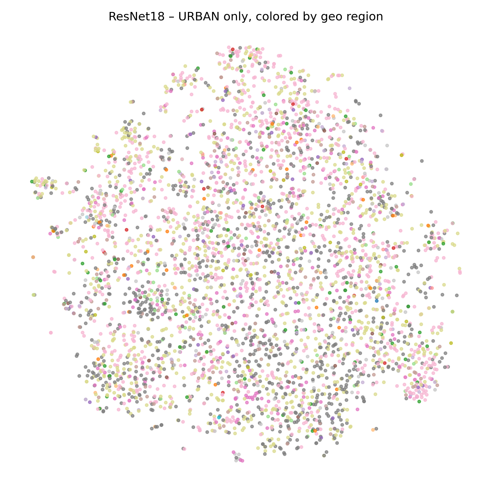
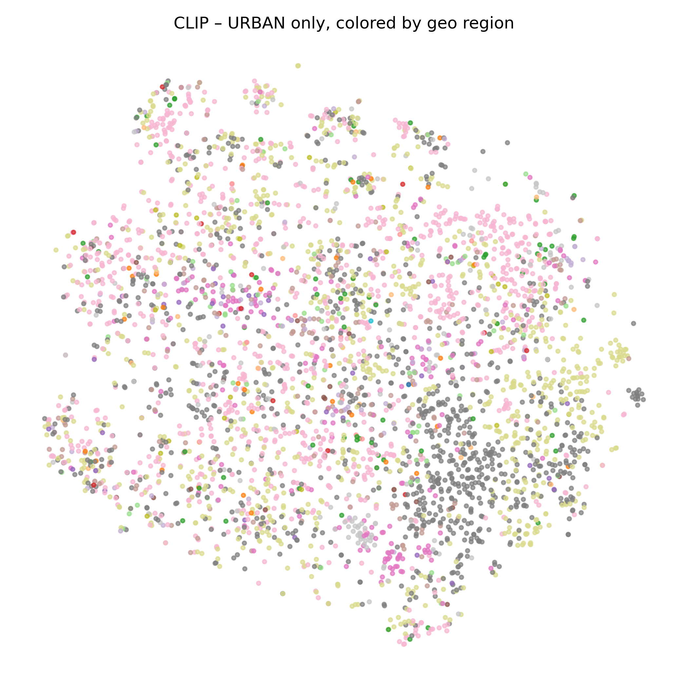

# IM2GPS Re-revisit: CLIP-powered Image Geolocation

This project explores the feasibility of predicting the geographic origin of an image using modern multimodal models, inspired by the seminal works **"IM2GPS: Estimating Geographic Information from a Single Image"** [1] and **"Revisiting IM2GPS in the Deep Learning Era"** [2].

While the original IM2GPS pipeline relied primarily on handcrafted features and nearest-neighbor retrieval, and its successor incorporated deep CNN representations, this project investigates whether **CLIP** [3]—a model trained on large-scale image-text pairs—can serve as a powerful visual feature extractor for the geolocation task.

## Project Overview

The core objective of this project is to evaluate and compare different feature representations for image geolocalization. Specifically, it contrasts the performance of **CLIP** (Contrastive Language-Image Pretraining) with traditional **ResNet** architectures in both structured classification and retrieval-based localization tasks.

### Key Findings
*   **Retrieval Superiority:** Combining CLIP features with k-Nearest Neighbors (k-NN) yields a substantial improvement in geolocation accuracy compared to ResNet. The mean distance error obtained with CLIP is nearly half that of ResNet.
*   **Classification Discrepancy:** Interestingly, CLIP performs worse than ResNet in structured geo-classification tasks (e.g., 3, 16, and 365 spatial categories).
*   **Feature Space Organization:** t-SNE visualizations reveal that CLIP embeddings form tighter, more coherent clusters for urban imagery compared to ResNet, which explains its superior performance in retrieval-based tasks.

## Methodology

### 1. Feature Extraction
The project utilizes pre-trained models to extract high-level visual features:
*   **CLIP (ViT-B/32):** Leverages multimodal representations aligned with natural language.
*   **ResNet-18:** Serves as a baseline for traditional CNN-based visual features.

### 2. Geolocation Pipeline
For the retrieval-based approach:
1.  Identify the **k-nearest neighbors** for each test image in the feature space.
2.  Compute weights and retrieve geographic coordinates (latitude, longitude) of neighbors.
3.  Project coordinates onto a **unit sphere** (x, y, z).
4.  Combine coordinates using computed weights.
5.  Reproject back to latitude and longitude for the final estimate.

### 3. Coarse Classification
A multi-head classifier is implemented to predict geographic bins (3, 16, and 365 categories) using the MediaEval 2016 (MP16) dataset.

## Repository Structure

| File/Directory | Description |
| :--- | :--- |
| `train.py` | Main script for training the multi-head geo-classification models. |
| `model.py` | Defines the `MultiHeadGeoCLIP` and `ResNet18MultiHead` architectures. |
| `geo_dataset.py` | Custom PyTorch Dataset for handling geotagged image data. |
| `loss.py` | Implementation of the multi-task loss function for classification. |
| `tsne_plot.py` / `tsne_plot2.py` | Scripts for generating t-SNE visualizations of feature spaces. |
| `results/` | Contains visualization results, including t-SNE plots and error analyses. |
| `utils/` | Utility functions for data processing and plotting. |

## Results Visualization

The `results/` directory contains several insightful visualizations:
*   **t-SNE Plots:** Comparing how CLIP and ResNet cluster scene types and urban regions.
*   **Error Analysis:** KDE histograms and world maps showing the distribution of geolocation errors.
*   **Points Map:** Visualization of the geographic distribution of the dataset.

|ResNet t-SNE|CLIP t-SNE|
|---|---|
|||

The t-SNE visualizations reveal a fundamental difference in how each model organizes geographic information: while ResNet features result in a diffuse and overlapping distribution of urban regions, CLIP embeddings form much tighter and more coherent clusters. This visual evidence explains why CLIP is significantly more effective for retrieval-based geolocation; its feature space naturally groups geographically similar images together, allowing for more precise nearest-neighbor matching and nearly halving the mean distance error compared to ResNet.

## References

1.  Hays, J., & Efros, A. A. (2008). *IM2GPS: Estimating Geographic Information from a Single Image*. CVPR.
2.  Vo, N., Jacobs, N., & Hays, J. (2017). *Revisiting IM2GPS in the Deep Learning Era*. ICCV.
3.  Radford, A., et al. (2021). *Learning Transferable Visual Models From Natural Language Supervision*. ICML.
4.  MediaEval 2016 Placing Task.
5.  He, K., et al. (2016). *Deep Residual Learning for Image Recognition*. CVPR.
